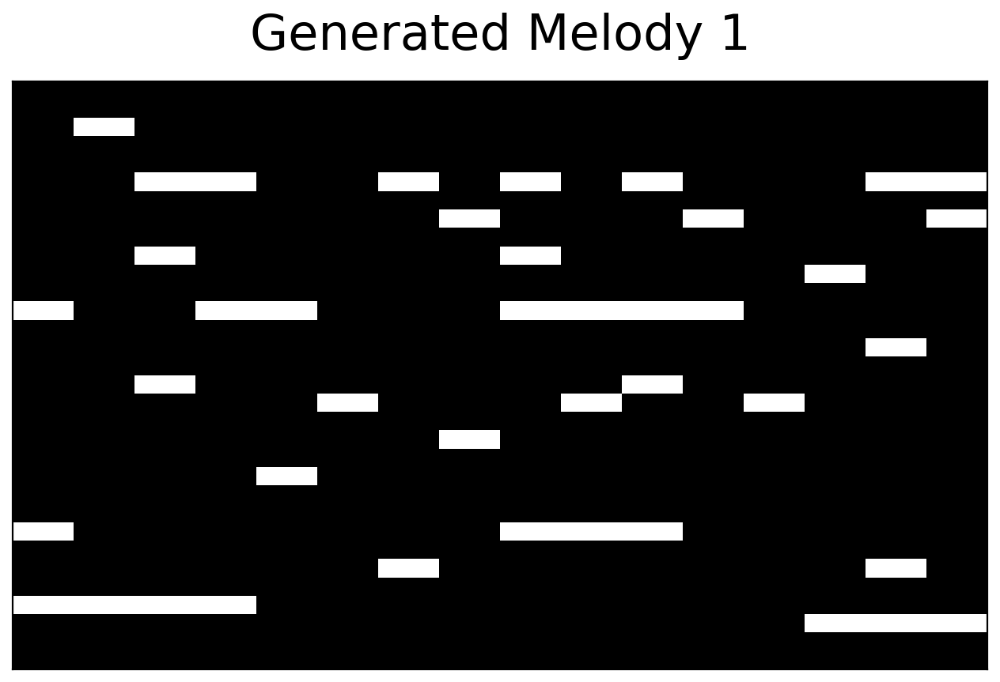
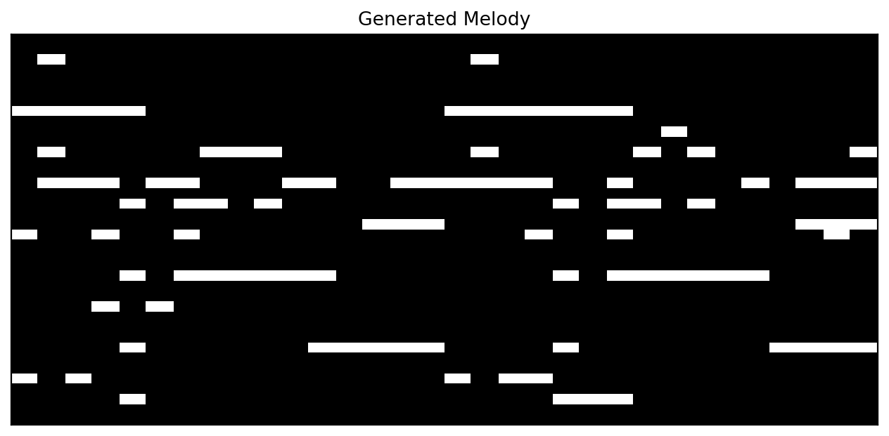

# Riffly

> Please open issues or PRs. Riffly is actively maintained, feedback and contributions are always welcome.

Riffly is a straightforward way to generate melodies: point it at a handful of MIDI files, train a small Variational Autoencoder on them, and sample short, loopable, and stylized riffs you can save as MIDI, render to audio, or plot. It implicitly ships a preprocessing pipeline that handles data augmentation, key detection, and tempo detection, turning raw MIDI files into training-ready piano-roll segments. Models are small enough to run entirely on a CPU: training takes minutes, inference takes under a second.

## Sample output

Unconditional samples — piano rolls with pitch on the y axis (low → high) and time on the x axis.

<p align="center">
  
  &nbsp;
  
</p>

Two loops generated by the `VAE` class in this repo, which I trained for these
samples. GitHub can't play audio inline, so the links below are downloads:

- Left — [`sample_left.wav`](assets/preview/sample_left.wav) · [`sample_left.mid`](assets/preview/sample_left.mid)
- Right — [`sample_right.wav`](assets/preview/sample_right.wav) · [`sample_right.mid`](assets/preview/sample_right.mid)

## Pretrained checkpoint

```python
from riffly import Riffly

model = Riffly("pop")            # downloads on first use, then cached
model.generate(n=4, save="out/", multi_track=True)
```

`Riffly("pop")` fetches a ~6 MB ConvVAE trained on the Pop subset of the
[ADL Piano MIDI Dataset](https://github.com/lucasnfe/adl-piano-midi)
(CC BY 4.0) from this repo's GitHub Releases. The file lands in
`$XDG_CACHE_HOME/riffly/weights/` (or `~/.cache/riffly/weights/`); override
with `$RIFFLY_HOME`. The sha256 is verified on every load.

## Install

```bash
pip install riffly                   # core (training + MIDI export)
pip install "riffly[interactive]"    # + audio rendering and plotting
```

Training, plotting, and `.wav` rendering need the `interactive` extra. With core only, pass `wav=False, png=False` to `generate(save=...)`.

`torch` installs the CUDA (GPU) build by default. On a CPU-only machine, force the CPU build:

```bash
uv pip install torch --torch-backend=cpu     # or set UV_TORCH_BACKEND=cpu
```

## Quickstart

```python
from riffly import Riffly

model = Riffly("convvae")                      # or "vae", "transformer"
model.train(data="datasets/adl-piano-midi", epochs=100)
model.generate(n=8, save="out/")               # writes MIDI + WAV + PNG for each melody
model.save("model.pt")

Riffly("model.pt").generate(n=4, save="more/", wav=False)   # opt out: MIDI + PNG only
```

That is the whole workflow: construct, `train`, `generate`, `save`.

Pass `generate(..., multi_track=True)` to split each melody into three voices, melody, chord, and 808 bass, in the saved `.mid` and `.wav`.

### Plotting a generation

`generate(save="out/")` writes a `.png` for every melody (like the piano rolls at the top of this README). To show one on screen instead:

```python
from riffly import Riffly, plot

model = Riffly("convvae")
roll = model.generate(n=1)[0]
plot(roll)
```

Plotting needs the `interactive` extra (see Install).

## Datasets

Point `train(data=...)` at any folder of `.mid` files. Three open datasets that work well out of the box:

| Dataset | Size | Source |
| --- | --- | --- |
| ADL Piano MIDI | ~11k piano MIDIs across many genres | https://github.com/lucasnfe/adl-piano-midi |
| Classical MIDI (Kaggle) | ~300 classical MIDIs | https://www.kaggle.com/datasets/soumikrakshit/classical-music-midi |
| The Magic of MIDI v1 | ~169k MIDIs scraped from the web | https://archive.org/details/themagicofmidi |

Download one, unzip it, and pass the folder path. The first run caches the preprocessed dataset under `~/.cache/riffly` (override with `$RIFFLY_CACHE` or `train(..., cache_dir=...)`) so later runs start instantly.

## Advanced usage

The facade wraps lower-level modules that you can still use directly for full control:

- `riffly.models` — `VAE`, `ConvVAE`, `TransformerVAE`.
- `riffly.datasets.MIDIDataset` — MIDI folder to `(rows, columns)` tensors.
- `riffly.train` — `train()`, `validation_loop()`.
- `riffly.processes` — `MIDIPostprocess`, `MultiTrackPostprocess` (melody + chords + 808 bass), `MIDIPreprocess`.
- `riffly.plots` — dataset previews, training curves, reconstruction grids.

## License

MIT. See [LICENSE](LICENSE).

The pretrained `pop` checkpoint distributed via GitHub Releases was trained
on the [ADL Piano MIDI Dataset](https://github.com/lucasnfe/adl-piano-midi)
(Ferreira & Whitehead, 2020), licensed CC BY 4.0. Attribution is preserved
when the checkpoint is redistributed.
